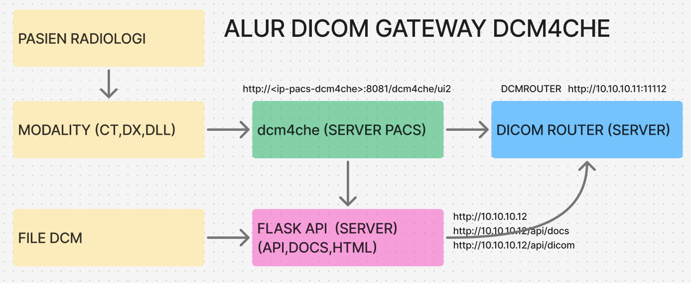
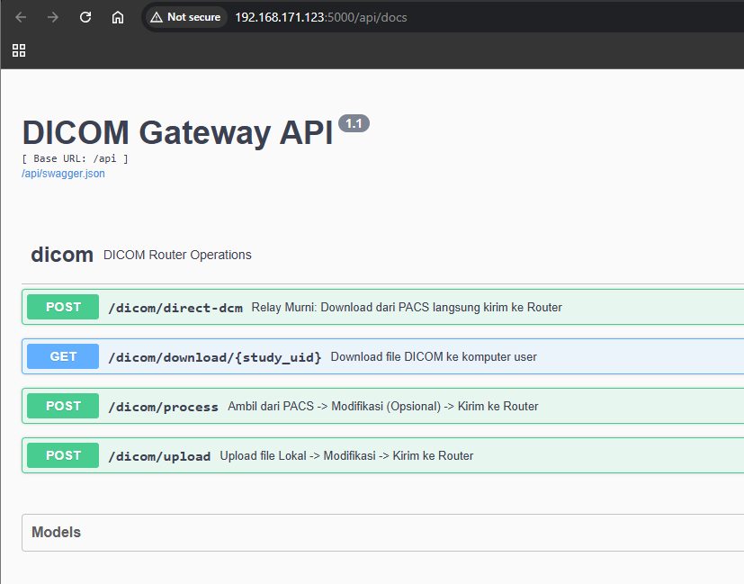
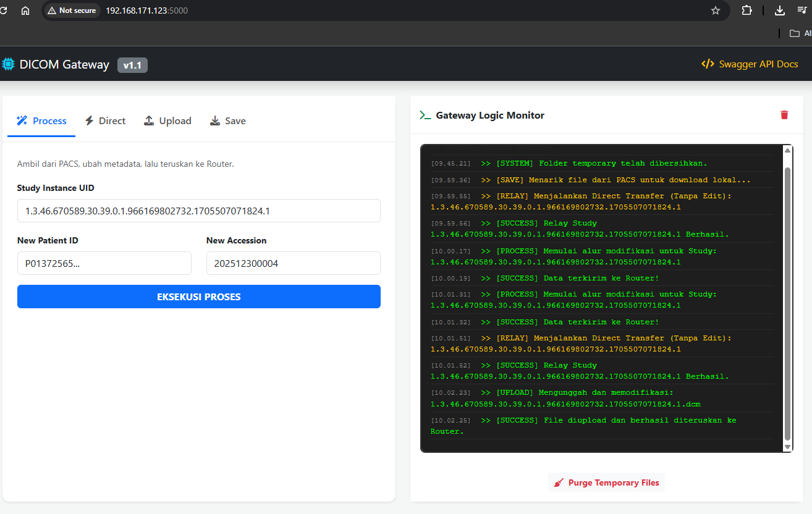
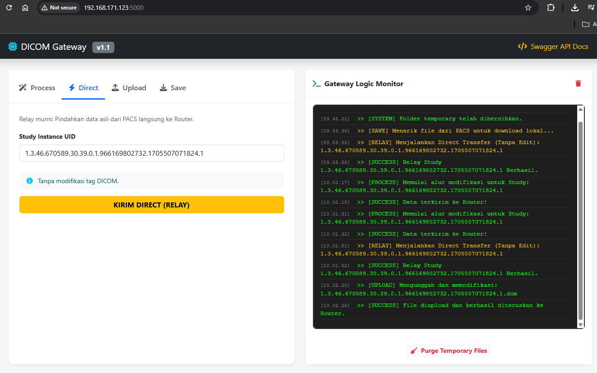
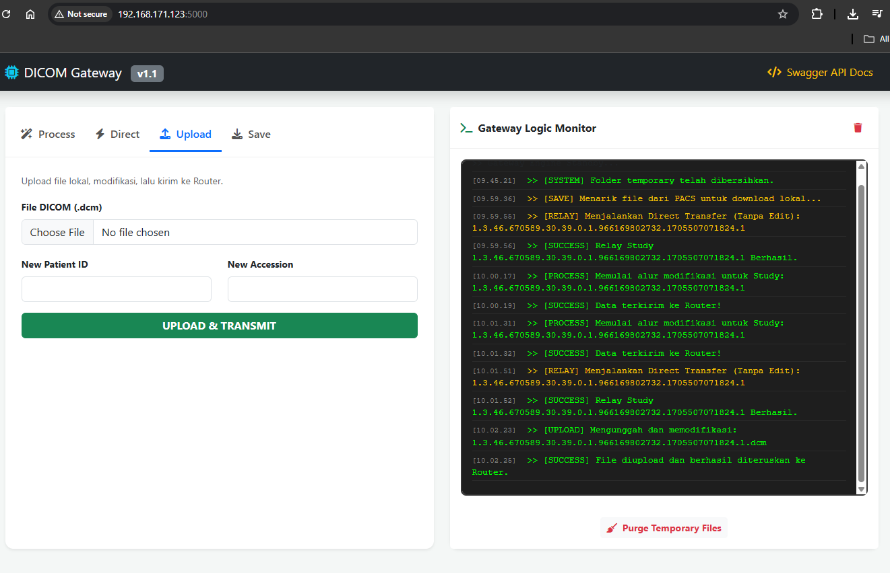
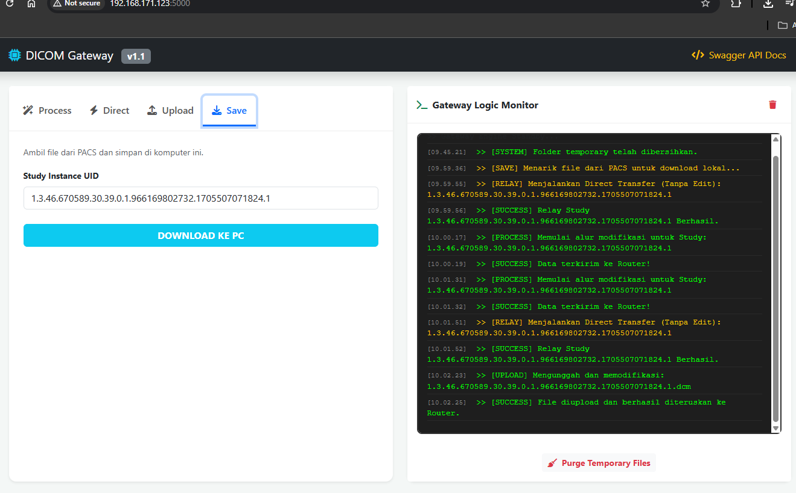

## FLASK API - DCM4CHE - DICOM ROUTER




### 1. API SPEC

| Method | Endpoint                     | Payload                    | Deskripsi                                      |
|--------|------------------------------|----------------------------|-----------------------------------------------|
| POST   | /api/dicom/process           | study, patientid, acc      | Download, edit metadata, lalu kirim.          |
| POST   | /api/dicom/direct-dcm        | {"study": "UID"}           | Relay murni: download & langsung kirim.       |
| POST   | /api/dicom/upload            | file, patientid, acc       | Upload dari PC, edit, lalu kirim.             |
| GET    | /api/dicom/download/{uid}    | -                          | Download ke browser (Save as file).           |


| Code | Status        | Deskripsi                              | Penyebab Umum                                                     |
|------|---------------|----------------------------------------|------------------------------------------------------------------|
| 200  | Success       | Operasi selesai tanpa gangguan.        | -                                                                |
| 400  | Bad Request   | Parameter input tidak lengkap / salah. | Format payload salah, field wajib tidak dikirim.                 |
| 404  | Not Found     | Study UID tidak ditemukan di PACS.     | UID tidak ada di database PACS / salah ketik.                    |
| 500  | Server Error  | Kesalahan pada server backend.         | Koneksi ke PACS terputus atau router (storescu) menolak koneksi. |


DICOM Gateway API DocumentationBase URL: http://<-server-ip>:5000/api

Cara Pengujian dengan cURLTest Process & Send:
```Bash
curl -X POST http://localhost:5000/api/dicom/process \
     -H "Content-Type: application/json" \
     -d '{"study": "UID_CONTOH", "patientid": "NEW_ID"}'


curl -X POST http://localhost:5000/api/dicom/upload \
     -F "file=@/path/to/file.dcm" \
     -F "patientid=12345"
```



WEB HTML










### 2. SERVER PACS DCM4CHEE


- Sudah punya server PACS dengan DCM4CHE

```
PASTIKAN 3 API INI TERSEDIA DAN BISA DIAKSES 

1. API DCM4CHE melihat metadata dari server pacs
http://<-ip-pacs-dcm4che>:8081/dcm4chee-arc/aets/DCM4CHEE/rs/studies/1.3.46.670589.30.39.0.1.966169802732.1695243280236.1/metadata

2. API DCM4CHE download file dcm dari server pacs de file lokal
http://<-ip-pacs-dcm4che>:8081/dcm4chee-arc/aets/DCM4CHEE/wado?requestType=WADO&studyUID=1.3.46.670589.30.39.0.1.966169802732.1695243280236.1&seriesUID=1.3.46.670589.30.39.0.1.966169802732.1695243642250.1&objectUID=1.3.46.670589.30.39.0.1.966169802732.1695243642379.1&contentType=application/dicom

3. API DCM4CHE download file dcm dari server pacs ke file lokal dengan nama file
curl -X GET "http://<-ip-pacs-dcm4che>:8081/dcm4chee-arc/aets/DCM4CHEE/wado?requestType=WADO&studyUID=1.3.46.670589.30.39.0.1.966169802732.1695243280236.1&seriesUID=1.3.46.670589.30.39.0.1.966169802732.1695243642250.1&objectUID=1.3.46.670589.30.39.0.1.966169802732.1695243642379.1&contentType=application/dicom" \ 
-o gambar_pasien.dcm   

```

### 3. SERVER dicom router docker 
- Sudah install dicom router docker 

```
mkdir dicom-router 
cd dicom-router 
nano docker-compose.yml 
```
```yml
services: 
  dicom-router: 
    image: registry.dto.kemkes.go.id/pub/dicom-router:latest 
    container_name: dicom-router 
    restart: always 
    ports: 
      - "11112:11112"   # DICOM port router 
      - "8080:8080"     # Web UI router 
    environment: 
      AE_TITLE: DCMROUTER 
      ORG_ID: "10009999" 
      CLIENT: "Gzn7Yj---------------" 
      SECRET: "fbPy8S---------------" 
      WEBHOOK_URL: "https://api-satusehat.kemkes.go.id" 
      WEBHOOK_USER: "youruser" 
      WEBHOOK_PASSWORD: "yourpass" 
      URL: "https://api-satusehat.kemkes.go.id" 
    networks: 
      - dicom-network 
 
networks: 
  dicom-network: 
    driver: bridge 
```
dicom router tidak perlu di daftarkan ke server pacs dcm4chee

```
docker compose up -d 
docker ps -a 
docker logs dicom-router | head -n 50 
docker logs -f dicom-router 
sudo netstat -tulpn | grep 11112 
```
PASTIKAN server dcm router berjalan
```
docker ps --filter "name=dicom-router"

CONTAINER ID   IMAGE                                               COMMAND                CREATED      STATUS      PORTS                                                                                          NAMES
3e7b0312d7d4   registry.dto.kemkes.go.id/pub/dicom-router:latest   "/app/entrypoint.sh"   2 days ago   Up 2 days   0.0.0.0:8080->8080/tcp, [::]:8080->8080/tcp, 0.0.0.0:11112->11112/tcp, [::]:11112->11112/tcp   dicom-router

```
### 4. DCMTK

- Sudah install DCMTK dalam OS

```
Install dcmtk
sudo apt install dcmtk -y 

Melihat patient id dan Acession Number
dcmdump gambar_pasien.dcm | grep -E "(0010,0020)|(0008,0050)"

Modify patient id dan Acession Number
dcmodify --ignore-errors \ 
-i "(0010,0020)=P00001349322" \ 
-i "(0008,0050)=202512300002" \ 
gambar_pasien.dcm 

Kirim file dcm ke dicom router
storescu -aec -v DCMROUTER <-ip-dicomrouter> 11112 ambar_pasien.dcm 

```

### 5. SATUSEHAT 

1. ENCOUNTER 
2. SERVICE REQUEST >> PATIENT ID, ACCESION NUMBER
- pasient id tidak diubah data tetap bisa dikirim ke satusehat
- mandatory accesion number wajib dikirim service request sama dengan accesion number pada gambar dicom

### 6. Persiapan flask pembuatan API di lokal

```py
git clone https://github.com/edycoleee/flask-dicomrouter-dcm dicom-gateway

cd dicom-gateway

# Update sistem
sudo apt update && sudo apt upgrade -y

# Install python3-venv jika belum ada
sudo apt install python3-venv -y

# Buat virtual environment
python3 -m venv venv

# Aktifkan virtual environment
source venv/bin/activate # Windows: venv\Scripts\activate

# Upgrade pip
pip install --upgrade pip

# Install package yang diperlukan
pip install flask flask-restx requests werkzeug

cd app
python app.py
```

### CLONE DAN RUNNING DI DOCKER

```
git clone https://github.com/edycoleee/flask-dicomrouter-dcm dicom-gateway

cd dicom-gateway
docker-compose up --build -d
docker-compose ps
docker logs -f dicom-gateway-app
```

akses swagger-ui dokumentasi
http://192.168.30.14:5000/docs

akses html-ui http://192.168.30.14:5000/

aksea langsung api http://192.168.30.14:5000/api