## FLASK API - DCM4CHE - DICOM ROUTER

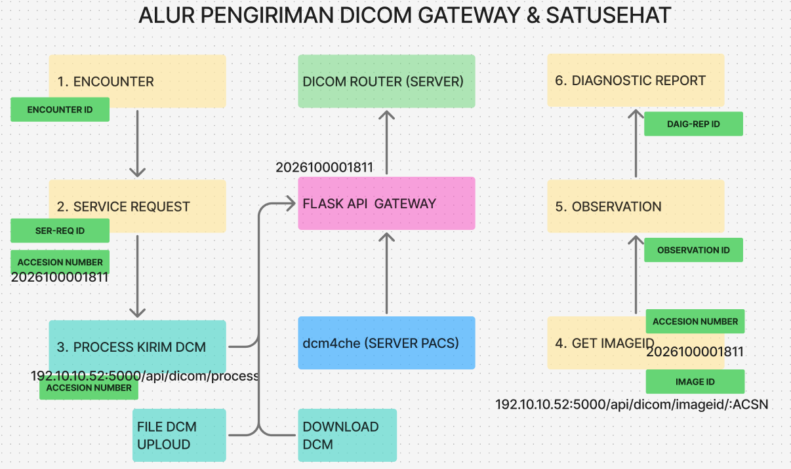


## ALUR PENGIRIMAN

```
1. KIRIM ENCOUNTER >> ENCOUNTER ID
2. KIRIM SERVICE REQUEST >> SERVICE REQ ID (ACCESION NUMBER SEBAGAI KUNCI PENGIRIMAN GAMBAR DICOM)
PENDAFTARAN ACCESION NUMBER KE SATU SEHAT
3. KIRIM GAMBAR DICOM >> SUCCESS (ACCESION NUMBER HARUS SAMA DENGAN SERVICE REQUEST)
4. GET IMAGE ID >> ACCESION NUMBER >> IMAGE ID
5. KIRIM OBSERVATION (TEXT AMBIL HASIL EXPERTISE) >> OBSERVATION ID
6. KIRIM DIAGNOSTIC REPORT (TEXT AMBIL HASIL EXPERTISE) >> DIAGNOSTIC REP ID 

```
REFERENSI DATA JSON SATUSEHAT : [service_data.js](service_data.js)

REFERENSI API DETAIL : [API_SPECS.md](API_SPECS.md)

http://192.10.10.52:5000/ >> WEB UI UNTUK SIMULASI

http://192.10.10.52:5000/api/docs >> API DOCUMENTATION

http://192.10.10.52:5000/api >> API


### 1. API SPEC


| Tag            | Method | Endpoint                             | Summary                                                                | Request Body / Params                                                                                                                                                                                                                                                                                                                                           | Success Response                                                                                                                    | Error Response                                    |
| -------------- | ------ | ------------------------------------ | ---------------------------------------------------------------------- | --------------------------------------------------------------------------------------------------------------------------------------------------------------------------------------------------------------------------------------------------------------------------------------------------------------------------------------------------------------- | ----------------------------------------------------------------------------------------------------------------------------------- | ------------------------------------------------- |
| **DICOM**      | POST   | `/dicom/process`                     | Proses DICOM (study / accession), modifikasi metadata, kirim ke Router | **Body (JSON)**<br>• `study` (string, opt)<br>• `patientid` (string, opt)<br>• `accesionnum` (string, opt)                                                                                                                                                                                                                                                      | **200 OK**<br>`status, study_uid, total_instance, sent_instance, failed_instance`<br><br>**207 Multi-Status**<br>`failed_details[]` | **400** Invalid request<br>**500** Internal error |
| **DICOM**      | POST   | `/dicom/upload`                      | Upload file DICOM dan kirim ke Router                                  | **multipart/form-data**<br>• `file` (file, req)<br>• `patientid` (string, opt)<br>• `accesionnum` (string, opt)                                                                                                                                                                                                                                                 | **200 OK**<br>`status, file, message`                                                                                               | **400** No file selected<br>**500** Upload failed |
| **DICOM**      | POST   | `/dicom/pacs/upload`                 | Upload file DICOM ke PACS (STOW-RS)                                    | **multipart/form-data**<br>• `file` (file, req)                                                                                                                                                                                                                                                                                                                 | **200 OK**<br>`status, pacs_status, response`                                                                                       | **4xx/5xx** PACS error                              |
| **DICOM**      | DELETE | `/dicom/pacs/studies/{study_uid}`    | Hapus study dari PACS (DCM4CHEE)                                       | **Path Param**<br>• `study_uid` (string)                                                                                                                                                                                                                                                                                                                        | **200 OK**<br>`status, pacs_status, response`                                                                                       | **4xx/5xx** PACS error                              |
| **DICOM**      | POST   | `/dicom/get-info`                    | Baca info DICOM dari file lokal                                        | **multipart/form-data**<br>• `file` (file, req)                                                                                                                                                                                                                                                                                                                 | **200 OK**<br>`study_uid, accession_number, patient_id`                                                                             | **400** No file selected<br>**500** Read failed    |
| **DICOM**      | GET    | `/dicom/download/{study_uid}`        | Download DICOM dari PACS                                               | **Path Param**<br>• `study_uid` (string)                                                                                                                                                                                                                                                                                                                        | **200 OK**<br>Binary DICOM file                                                                                                     | **404** Study not found<br>**500** PACS error     |
| **SATU-SEHAT** | POST   | `/satset/encounter`                  | Create Encounter (FHIR)                                                | **Body (JSON)**<br>• `identifier_value` (req)<br>• `subject_id` (req)<br>• `subject_display` (req)<br>• `practitioner_id` (req)<br>• `practitioner_display` (req)<br>• `period_start` (req)<br>• `period_end` (opt)<br>• `location_id` (req)<br>• `location_display` (req)                                                                                      | **201 Created**<br>`encounter_id, resource`                                                                                         | **400** Missing field<br>**502** Auth/FHIR error  |
| **SATU-SEHAT** | POST   | `/satset/service-req`                | Create ServiceRequest (FHIR)                                           | **Body (JSON)**<br>• `identifier_value` (req)<br>• `noacsn` (req)<br>• `subject_id` (req)<br>• `encounter_id` (req)<br>• `period_start` (req)<br>• `practitioner_id` (req)<br>• `practitioner_display` (req)<br>• `performer_id` (req)<br>• `performer_display` (req)                                                                                           | **201 Created**<br>`service_request_id, resource`                                                                                   | **400** Validation error<br>**502** FHIR error    |
| **SATU-SEHAT** | POST   | `/satset/observation`                | Create Observation (FHIR)                                              | **Body (JSON)**<br>• `identifier_value` (req)<br>• `codind_code` (req)<br>• `coding_display` (req)<br>• `subject_id` (req)<br>• `subject_display` (req)<br>• `encounter_id` (req)<br>• `period_start` (req)<br>• `performer_id` (req)<br>• `performer_display` (req)<br>• `performer_value` (req)<br>• `service_request_id` (opt)<br>• `imaging_study_id` (opt) | **201 Created**<br>`observation_id, resource`                                                                                       | **400** Invalid data<br>**502** FHIR error        |
| **SATU-SEHAT** | POST   | `/satset/diag-rep`                   | Create DiagnosticReport (FHIR)                                         | **Body (JSON)**<br>• `identifier_value` (req)<br>• `codind_code` (req)<br>• `coding_display` (req)<br>• `subject_id` (req)<br>• `encounter_id` (req)<br>• `period_start` (req)<br>• `performer_id` (req)<br>• `imaging_study_id` (opt)<br>• `observation_id` (opt)<br>• `service_request_id` (opt)<br>• `conclusion_text` (opt)                                 | **201 Created**<br>`diagnostic_report_id, resource`                                                                                 | **400** Validation error<br>**502** FHIR error    |
| **SATU-SEHAT** | GET    | `/satset/imageid/{accession_number}` | Get ImagingStudy ID by Accession Number                                | **Path Param**<br>• `accession_number` (string)                                                                                                                                                                                                                                                                                                                 | **200 OK**<br>`imagingStudy_id, patient_reference`                                                                                  | **404** Not found<br>**502** FHIR error           |
| GET    | /api/dicom/get-study/{acsn}  | -                          | Get study information dari PACS by Accession Number. |
| GET    | /api/dicom/get-thumbnail/{acsn} | -                       | Get thumbnail image dari PACS by Accession Number. |
| GET    | /api/dicom/get-image/{acsn}  | -                          | Download study lengkap (ZIP) dari PACS by Accession Number. |
| POST   | /api/dicom/get-info          | -                          | Baca info DICOM (Study UID, Accession, Patient ID) dari file lokal. |
| POST   | /api/dicom/pacs/upload       | -                          | Upload file DICOM ke PACS (STOW-RS). |
| DELETE | /api/dicom/pacs/studies/{study_uid} | -                 | Hapus study dari PACS (DCM4CHEE). |
| GET    | /api/satset/imageid/{acsn}   | -                          | Lihat Imaging Study ID setelah kirim ke satusehat. |


---

## 🧩 Catatan

* Semua **datetime** menggunakan **ISO8601**
* Semua **ID otomatis di-prefix** sesuai tipe resource FHIR
* Endpoint FHIR melakukan **autentikasi sebelum request**
* Error response **konsisten**:

```json
{ "status": "error", "message": "..." }
```

---
DICOM Gateway API DocumentationBase URL: http://<-server-ip>:5000/api

Cara Pengujian dengan cURLTest Process & Send:
```Bash
curl -X POST http://localhost:5000/api/dicom/process \
     -H "Content-Type: application/json" \
     -d '{"study": "UID_CONTOH", "patientid": "NEW_ID"}'


curl -X POST http://localhost:5000/api/dicom/upload \
     -F "file=@/path/to/file.dcm" \
     -F "patientid=12345"
```

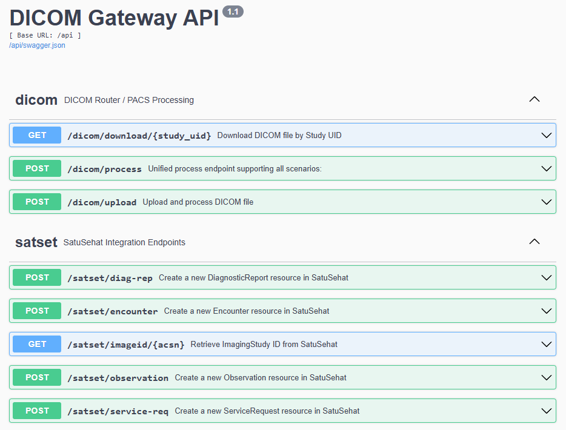

WEB HTML

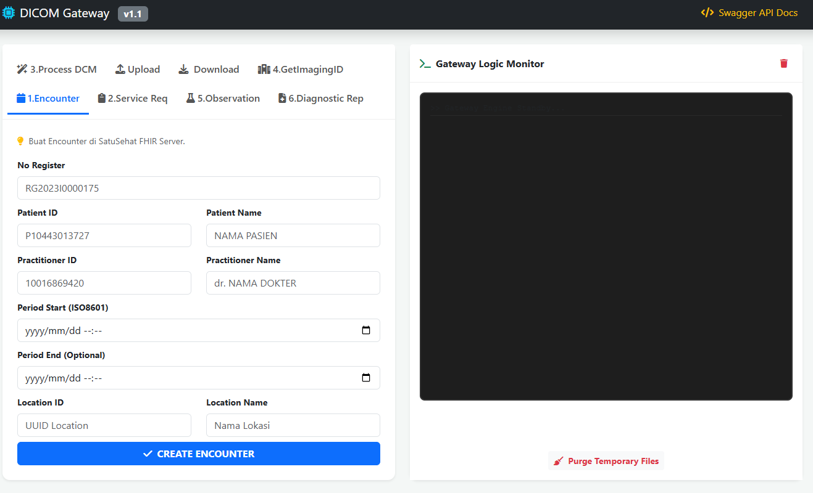

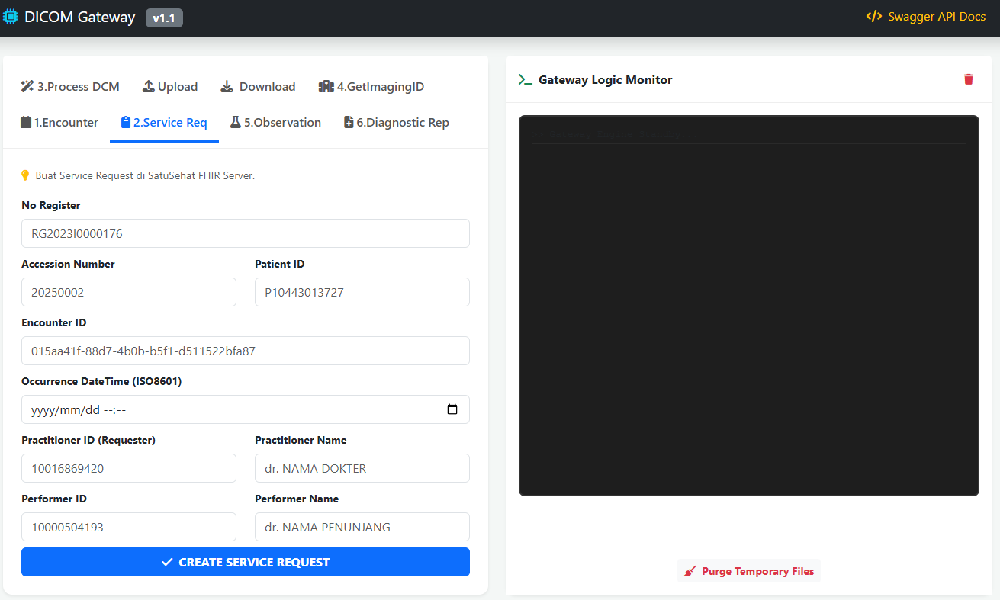

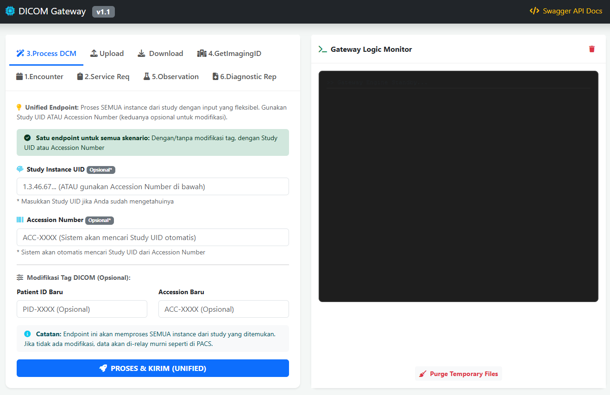

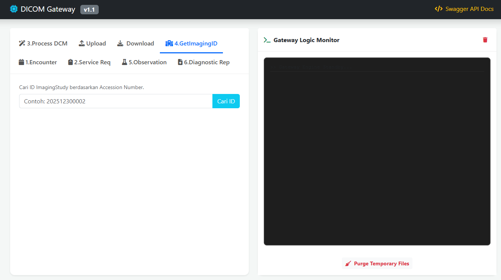

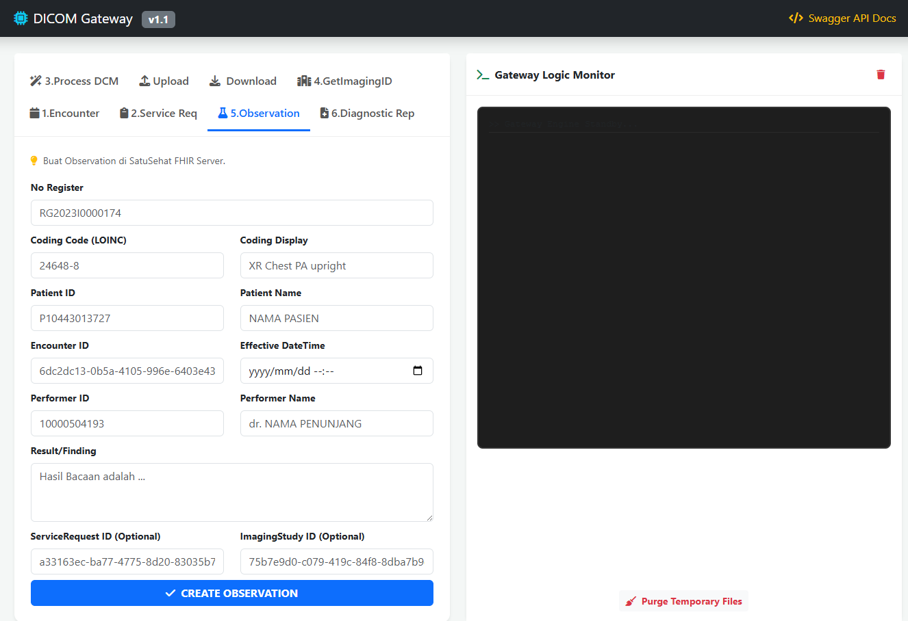

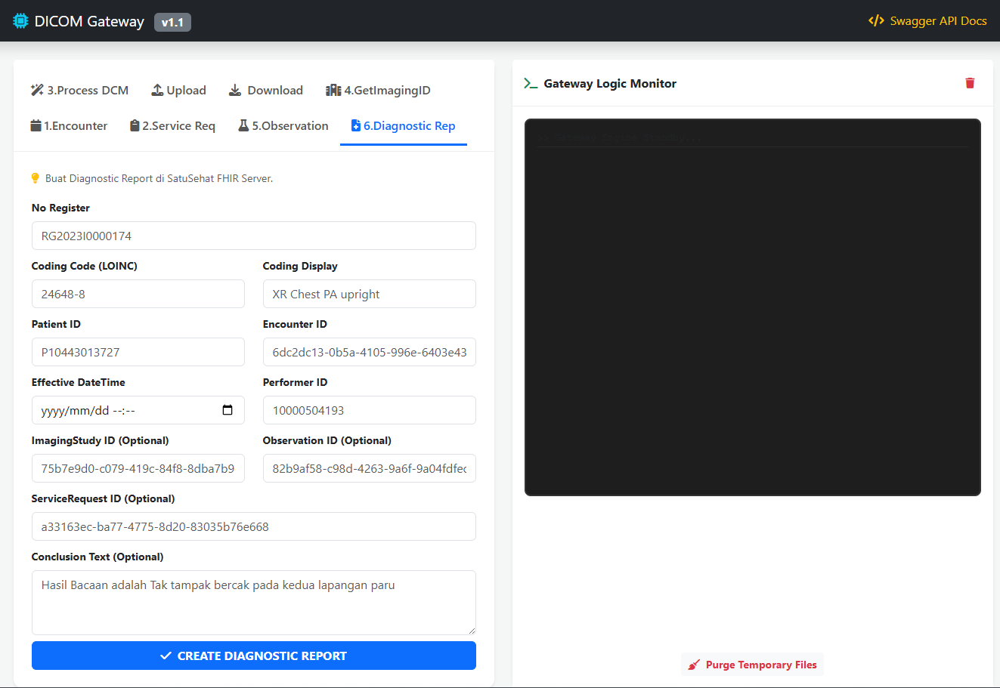

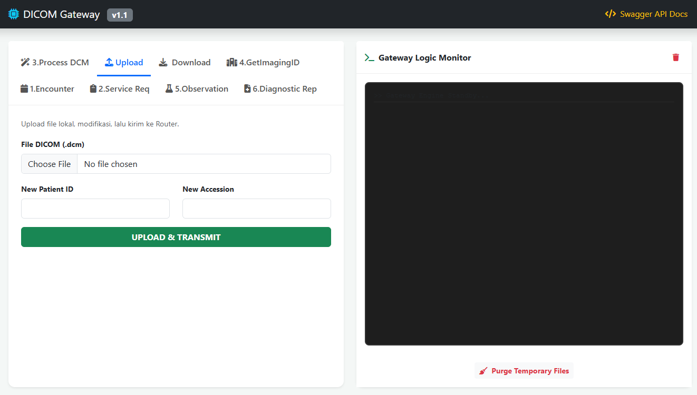

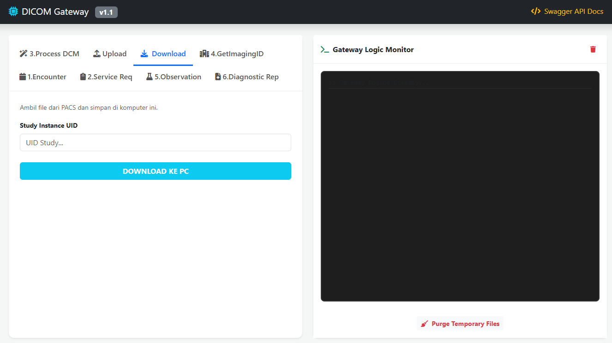

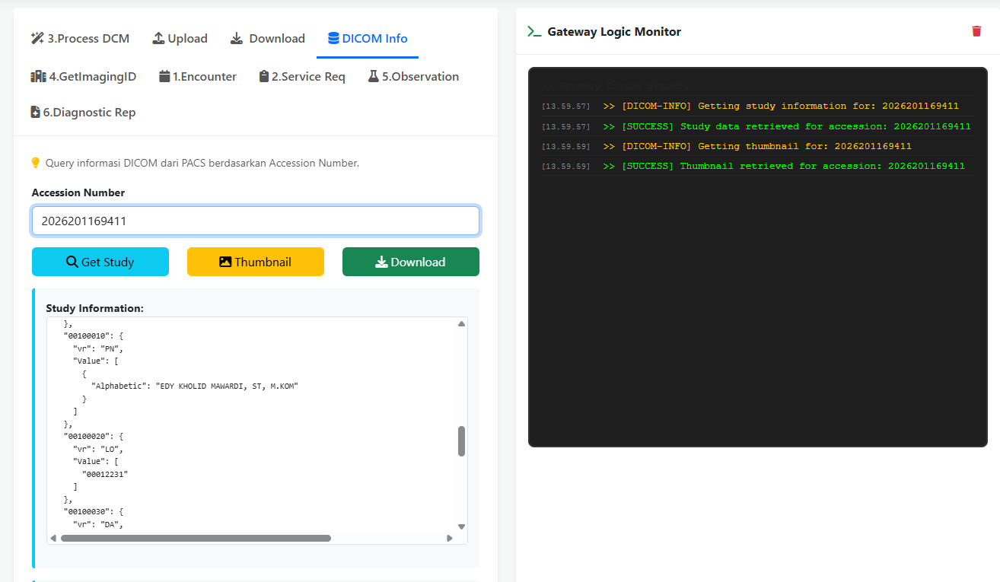

### 2. SERVER PACS DCM4CHEE


- Sudah punya server PACS dengan DCM4CHE

```
PASTIKAN 4 API INI TERSEDIA DAN BISA DIAKSES 

1. API DCM4CHE melihat metadata dari server pacs
http://<-ip-pacs-dcm4che>:8081/dcm4chee-arc/aets/DCM4CHEE/rs/studies/1.3.46.670589.30.39.0.1.966169802732.1695243280236.1/metadata

2. API DCM4CHE download file dcm dari server pacs de file lokal
http://<-ip-pacs-dcm4che>:8081/dcm4chee-arc/aets/DCM4CHEE/wado?requestType=WADO&studyUID=1.3.46.670589.30.39.0.1.966169802732.1695243280236.1&seriesUID=1.3.46.670589.30.39.0.1.966169802732.1695243642250.1&objectUID=1.3.46.670589.30.39.0.1.966169802732.1695243642379.1&contentType=application/dicom

3. API DCM4CHE download file dcm dari server pacs ke file lokal dengan nama file
curl -X GET "http://<-ip-pacs-dcm4che>:8081/dcm4chee-arc/aets/DCM4CHEE/wado?requestType=WADO&studyUID=1.3.46.670589.30.39.0.1.966169802732.1695243280236.1&seriesUID=1.3.46.670589.30.39.0.1.966169802732.1695243642250.1&objectUID=1.3.46.670589.30.39.0.1.966169802732.1695243642379.1&contentType=application/dicom" \ 
-o gambar_pasien.dcm   

4. API DCM4CHE mencari data dari server pacs
http://<-ip-pacs-dcm4che>/dcm4chee-arc/aets/DCM4CHEE/rs/studies?AccessionNumber=2026100001321 
http://<-ip-pacs-dcm4che>/dcm4chee-arc/aets/DCM4CHEE/rs/studies?PatientID=00030983 

```

### 3. SERVER dicom router docker 
- Sudah install dicom router docker 

```
mkdir dicom-router 
cd dicom-router 
nano docker-compose.yml 
```
```yml
services: 
  dicom-router: 
    image: registry.dto.kemkes.go.id/pub/dicom-router:latest 
    container_name: dicom-router 
    restart: always 
    ports: 
      - "11112:11112"   # DICOM port router 
      - "8080:8080"     # Web UI router 
    environment: 
      AE_TITLE: DCMROUTER 
      ORG_ID: "10009999" 
      CLIENT: "Gzn7Yj---------------" 
      SECRET: "fbPy8S---------------" 
      WEBHOOK_URL: "https://api-satusehat.kemkes.go.id" 
      WEBHOOK_USER: "youruser" 
      WEBHOOK_PASSWORD: "yourpass" 
      URL: "https://api-satusehat.kemkes.go.id" 
    networks: 
      - dicom-network 
 
networks: 
  dicom-network: 
    driver: bridge 
```
dicom router tidak perlu di daftarkan ke server pacs dcm4chee

```
docker compose up -d 
docker ps -a 
docker logs dicom-router | head -n 50 
docker logs -f dicom-router 
sudo netstat -tulpn | grep 11112 
```
PASTIKAN server dcm router berjalan
```
docker ps --filter "name=dicom-router"

CONTAINER ID   IMAGE                                               COMMAND                CREATED      STATUS      PORTS                                                                                          NAMES
3e7b0312d7d4   registry.dto.kemkes.go.id/pub/dicom-router:latest   "/app/entrypoint.sh"   2 days ago   Up 2 days   0.0.0.0:8080->8080/tcp, [::]:8080->8080/tcp, 0.0.0.0:11112->11112/tcp, [::]:11112->11112/tcp   dicom-router

```
### 4. DCMTK

- Sudah install DCMTK dalam OS

```
Install dcmtk
sudo apt install dcmtk -y 

Melihat patient id dan Acession Number
dcmdump gambar_pasien.dcm | grep -E "(0010,0020)|(0008,0050)"

Modify patient id dan Acession Number
dcmodify --ignore-errors \ 
-i "(0010,0020)=P00001349322" \ 
-i "(0008,0050)=202512300002" \ 
gambar_pasien.dcm 

Kirim file dcm ke dicom router
storescu -aec -v DCMROUTER <-ip-dicomrouter> 11112 ambar_pasien.dcm 

```

### 5. SATUSEHAT 

1. ENCOUNTER 
2. SERVICE REQUEST >> PATIENT ID, ACCESION NUMBER
- pasient id tidak diubah data tetap bisa dikirim ke satusehat
- mandatory accesion number wajib dikirim service request sama dengan accesion number pada gambar dicom

### 6. Persiapan flask pembuatan API di lokal

```py
git clone https://github.com/edycoleee/flask-dicomrouter-dcm dicom-gateway

cd dicom-gateway

# Update sistem
sudo apt update && sudo apt upgrade -y

# Install python3-venv jika belum ada
sudo apt install python3-venv -y

# Buat virtual environment
python3 -m venv venv

# Aktifkan virtual environment
source venv/bin/activate # Windows: venv\Scripts\activate

# Upgrade pip
pip install --upgrade pip

# Install package yang diperlukan
pip install flask flask-restx requests werkzeug python-dotenv 

cd app
python app.py
```

### CLONE DAN RUNNING DI DOCKER

```
git clone https://github.com/edycoleee/flask-dicomrouter-dcm dicom-gateway

cd dicom-gateway
docker-compose up --build -d
docker-compose ps
docker logs -f dicom-gateway-app
```

akses swagger-ui dokumentasi
http://192.168.30.14:5000/docs

akses html-ui http://192.168.30.14:5000/

akses langsung api http://192.168.30.14:5000/api

buat file .env
```
# --- DCM4CHEE ---
DCM4CHEE_URL=http://192.10.10.23:8081/dcm4chee-arc/aets/DCM4CHEE

# --- ROUTER STORESCU ---
ROUTER_IP=192.10.10.51
ROUTER_PORT=11112
ROUTER_AET=DCMROUTER

# --- LOGGING ---
LOG_FILE=app_dicom.log

# --- TEMP DIRECTORY ---
TEMP_DIR=/tmp/dicom_gateway_tmp

# --- SATUSEHAT ---
AUTH_URL = https://api-satusehat.kemkes.go.id/oauth2/v1
BASE_URL = https://api-satusehat.kemkes.go.id/fhir-r4/v1
ORG_ID = 
CLIENT_ID = 
CLIENT_SECRET = 
```

### RESPONSE DARI DICOM ROUTER 

 Responnya sukses tidak bisa dilihat dari api dicom gateway, tapi hanya bisa dilihat dari dalam log dicom router :
```
docker logs dicom-router --tail 50
```
- RESPONSE SUKSES
```
D: ========================== INCOMING DIMSE MESSAGE ==========================
D: Message Type                  : C-STORE RQ
D: Presentation Context ID       : 63
D: Message ID                    : 1
D: Affected SOP Class UID        : Digital X-Ray Image Storage - For Presentation
D: Affected SOP Instance UID     : 1.3.46.670589.30.39.0.1.966169802732.1757423874385.1
D: Data Set                      : Present
D: Priority                      : Medium
D: ============================ END DIMSE MESSAGE =============================
I: [Info-Assoc] - handle_store
D: pydicom.read_dataset() TransferSyntax="Little Endian Implicit"
I: Directory created
I: Association Released
I: Processing DICOM start
I: Accession Number: 202512300---
I: Study IUID: 1.3.46.670589.30.39.0.1.966169802732.1757423826764.1
I: Obtaining Patient ID and ServiceRequest ID
I: Patient ID and ServiceRequest ID obtained
I: Encryption Config is False
I: Start creating ImagingStudy
I: ImagingStudy 1.3.46.670589.30.39.0.1.966169802732.1757423826764.1 created
I: POST-ing ImagingStudy
```
 ```json
{
  "basedOn": [
    {
      "reference": "ServiceRequest/ce124594---------"
    }
  ],
  "description": "Chest",
  "id": "4630e0ce-26a6-4ae5-------",
  "identifier": [
    {
      "system": "http://sys-ids.kemkes.go.id/acsn/100025702",
      "type": {
        "coding": [
          {
            "code": "ACSN",
            "system": "http://terminology.hl7.org/CodeSystem/v2-0203"
          }
        ]
      },
      "use": "usual",
      "value": "202512300---"
    },
    {
      "system": "urn:dicom:uid",
      "value": "urn:oid:1.3.46.670589.30.39.0.1.966169802732.1757423826764.1"
    }
  ],
  "meta": {
    "lastUpdated": "2026-01-07T04:45:00.073409+00:00",
    "versionId": "MTc2Nzc2MTEwMDA3MzQwOTAwMA"
  },
  "modality": [
    {
      "code": "DX",
      "system": "http://dicom.nema.org/resources/ontology/DCM"
    }
  ],
  "numberOfInstances": 1,
  "numberOfSeries": 1,
  "resourceType": "ImagingStudy",
  "series": [
    {
      "description": "Chest",
      "instance": [
        {
          "number": 1,
          "sopClass": {
            "code": "urn:oid:1.2.840.10008.5.1.4.1.1.1.1",
            "system": "urn:ietf:rfc:3986"
          },
          "title": "ORIGINAL\\PRIMARY",
          "uid": "1.3.46.670589.30.39.0.1.966169802732.1757423874385.1"
        }
      ],
      "modality": {
        "code": "DX",
        "system": "http://dicom.nema.org/resources/ontology/DCM"
      },
      "number": 1,
      "numberOfInstances": 1,
      "started": "2025-09-09T14:17:32+07:00",
      "uid": "1.3.46.670589.30.39.0.1.966169802732.1757423874364.1"
    }
  ],
  "started": "2025-09-09T14:17:30+07:00",
  "status": "available",
  "subject": {
    "reference": "Patient/P00284578---"
  }
}

 ```  
 ```
I: ImagingStudy POST-ed, id: 4630e0ce-26a6-4ae5-ab02-c66138ee1bbe
I: DICOM Push started
I: dicom_push imagingStudyID: 4630e0ce-26a6-4ae5-ab02-c66138ee1bbe
I: Sending Instance UID: 1.3.46.670589.30.39.0.1.966169802732.1757423874364.1/1.3.46.670589.30.39.0.1.966169802732.1757423874385.1 success
I: DICOM sent successfully
I: Deleting association folder

 ```

- RESPONSE ERROR

Accession number(Number) dan Patient id(Tidak Kososng) tidak sesuai format yang diperbolehkan

 ```
 D: User Identity Negotiation Response: None
D: ========================== END A-ASSOCIATE-AC PDU ==========================
D: pydicom.read_dataset() TransferSyntax="Little Endian Implicit"
I: Received Store Request
D: ========================== INCOMING DIMSE MESSAGE ==========================
D: Message Type                  : C-STORE RQ
D: Presentation Context ID       : 63
D: Message ID                    : 1
D: Affected SOP Class UID        : Digital X-Ray Image Storage - For Presentation
D: Affected SOP Instance UID     : 1.3.46.670589.30.39.0.1.966169802732.1757423874385.1
D: Data Set                      : Present
D: Priority                      : Medium
D: ============================ END DIMSE MESSAGE =============================
I: [Info-Assoc] - handle_store
D: pydicom.read_dataset() TransferSyntax="Little Endian Implicit"
I: Directory created
I: Association Released
I: Processing DICOM start
I: Accession Number:
I: Study IUID: 1.3.46.670589.30.39.0.1.966169802732.1757423826764.1
I: Obtaining Patient ID and ServiceRequest ID
I: Patient ID and ServiceRequest ID obtained
I: Encryption Config is False
I: Start creating ImagingStudy
E: 'NoneType' object has no attribute 'json'
E: Failed to create ImagingStudy for 1.3.46.670589.30.39.0.1.966169802732.1757423826764.1
I: Deleting association folder
 ```
Accession number belum di daftarkan dengan service request

 ```
D: User Identity Negotiation Response: None
D: ========================== END A-ASSOCIATE-AC PDU ==========================
D: pydicom.read_dataset() TransferSyntax="Little Endian Implicit"
I: Received Store Request
D: ========================== INCOMING DIMSE MESSAGE ==========================
D: Message Type                  : C-STORE RQ
D: Presentation Context ID       : 63
D: Message ID                    : 1
D: Affected SOP Class UID        : Digital X-Ray Image Storage - For Presentation
D: Affected SOP Instance UID     : 1.3.46.670589.30.39.0.1.966169802732.1767272497253.1
D: Data Set                      : Present
D: Priority                      : Medium
D: ============================ END DIMSE MESSAGE =============================
I: [Info-Assoc] - handle_store
D: pydicom.read_dataset() TransferSyntax="Little Endian Implicit"
I: Directory created
I: Association Released
I: Processing DICOM start
I: Accession Number: 202512300---
I: Study IUID: 1.3.46.670589.30.39.0.1.966169802732.1767272178983.1
I: Obtaining Patient ID and ServiceRequest ID
E: Failed to obtain Patient ID and ServiceRequest ID
Traceback (most recent call last):
  File "internal/dicom_handler.py", line 159, in handle_assoc_released
    serviceRequestID, patientID = satusehat.get_service_request(accession_no)
                                  ^^^^^^^^^^^^^^^^^^^^^^^^^^^^^^^^^^^^^^^^^^^
  File "interface/satusehat.py", line 28, in get_service_request
    raise Exception("ServiceRequest not found")
Exception: ServiceRequest not found
I: Encryption Config is False
I: Deleting association folder
 ```

 ### MEMASTIKAN IMAGE SUDAH DITERIMA OLEH SATUSEHAT

 GET  http://192.168.171.123:5000/api/dicom/imageid/20250002

 Lookup ImagingStudy by ACSN and return the ImagingStudy id.
 
 	
Response body
```json
 {
  "status": "success",
  "imagingStudy_id": "75b7e9d0-c079-419c-84f8-8dba7b9cd585",
  "patient_reference": "Patient/P104430137--"
}